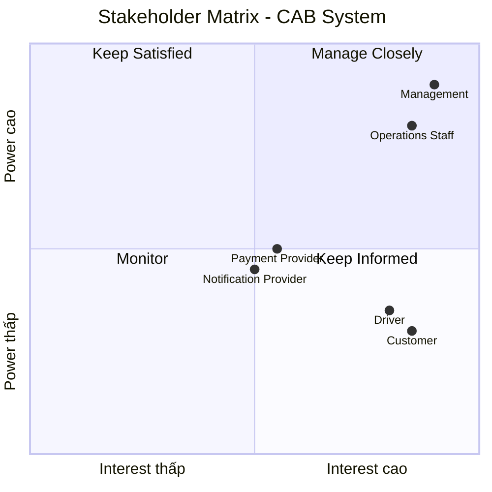

1. Đọc và phân tích yêu cầu sơ khởi của khách hàng ở giai đoạn 1  
1.1 Business Context (Ngữ cảnh nghiệp vụ)
Công ty ABC là doanh nghiệp cung cấp dịch vụ đặt xe trực tuyến.
Hiện tại khách hàng có thể:
- Liên hệ tổng đài để yêu cầu xe.
- Hoặc sử dụng một ứng dụng đơn giản để yêu cầu xe.
- Doanh nghiệp muốn xây dựng hệ thống CAB System – Nền tảng đặt xe với thời gian xây dựng và triển khai là 7 tuần.
- Ban lãnh đạo mong muốn xây dựng một nền tảng CAB mới có khả năng:
- Phục vụ số lượng lớn khách hàng và tài xế.
- Có thể phát triển thêm các tính năng trong tương lai. 
1.2 Business Problem (Vấn đề của nghiệp vụ)
Hệ thống hiện tại đang gặp các vấn đề sau:
- Việc phân công tài xế chủ yếu được thực hiện thủ công.
- Khách hàng khó theo dõi trạng thái chuyến đi.
- Thông tin thanh toán chưa được quản lý tập trung.
- Bộ phận vận hành gặp khó khăn khi muốn mở rộng hệ thống.

2. lập bảng xác định Stakeholders , lập ma trận Stakeholders matrix nêu ra tầm ảnh hưởng (bằng mermaid)
| Tên Stakeholder | Vai trò |
|-----------------|----------|
| Khách hàng | - Đăng ký, đăng nhập tài khoản. - Cập nhật thông tin cá nhân. - Nhập điểm đón, điểm đến, chọn loại xe. - Gửi yêu cầu đặt xe và theo dõi chuyến đi. - Xem lịch sử chuyến đi, số tiền phải trả và đánh giá tài xế. |
| Tài xế | - Đăng ký hoặc được tạo tài khoản. - Cập nhật hồ sơ, phương tiện và trạng thái hoạt động. - Nhận hoặc từ chối chuyến. - Cập nhật trạng thái chuyến đi. - Cung cấp thông tin vị trí để hỗ trợ tìm tài xế. |
| Nhân viên vận hành | - Quản lý khách hàng, tài xế, phương tiện và chuyến đi. - Theo dõi các chuyến đang diễn ra. - Kiểm tra trạng thái tài xế. - Hỗ trợ xử lý chuyến bị lỗi. - Tra cứu lịch sử giao dịch. - Thực hiện chức năng quản trị theo phân quyền. |
| Ban lãnh đạo / Ban giám đốc | - Mong muốn xây dựng nền tảng CAB có khả năng phục vụ nhiều khách hàng và tài xế. - Có thể mở rộng tính năng trong tương lai. - Theo dõi báo cáo về số lượng chuyến, doanh thu, tỷ lệ hoàn thành, tỷ lệ hủy và hiệu quả hoạt động của tài xế. |
| Doanh nghiệp (Công ty ABC) | - Đưa ra các yêu cầu về tìm tài xế, thanh toán, thông báo, quản trị, khả năng mở rộng, bảo mật và kiến trúc hệ thống. |
| Nhà cung cấp thanh toán bên ngoài | - Cung cấp dịch vụ thanh toán điện tử để hệ thống CAB tích hợp. - Không lưu trực tiếp thông tin nhạy cảm của thẻ hoặc tài khoản thanh toán trong hệ thống CAB. |

3. Xác định business goal
| Business Goal | Mục đích |
|---------------|----------|
| Xây dựng nền tảng CAB mới | Thay thế hệ thống hiện tại bằng một nền tảng có khả năng phục vụ số lượng lớn khách hàng và tài xế, đồng thời có thể phát triển thêm các tính năng trong tương lai. |
| Hỗ trợ đầy đủ quy trình đặt xe | Đáp ứng toàn bộ quy trình từ khi khách hàng tạo yêu cầu, tìm và phân công tài xế, thực hiện chuyến, tính cước, thanh toán, thông báo đến đánh giá sau chuyến. |
| Cải thiện quy trình phân công tài xế | Xác định và ưu tiên tài xế phù hợp, gần khách hàng; tiếp tục tìm tài xế khác nếu tài xế được đề xuất không phản hồi hoặc từ chối; thông báo cho khách hàng khi không tìm được tài xế. |
| Quản lý thanh toán an toàn | Hỗ trợ thanh toán bằng tiền mặt và thanh toán điện tử; tích hợp với nhà cung cấp thanh toán bên ngoài; không lưu trực tiếp thông tin nhạy cảm của thẻ hoặc tài khoản thanh toán trong hệ thống CAB. |
| Cung cấp hệ thống thông báo | Thông báo cho khách hàng và tài xế về các sự kiện của chuyến đi; có khả năng mở rộng thêm các kênh thông báo trong tương lai mà không phải thay đổi toàn bộ hệ thống. |
| Hỗ trợ quản trị và theo dõi hoạt động | Cung cấp giao diện quản trị để quản lý khách hàng, tài xế, phương tiện và chuyến đi; hỗ trợ tra cứu lịch sử giao dịch và báo cáo về số lượng chuyến, doanh thu, tỷ lệ chuyến hoàn thành, tỷ lệ hủy và hiệu quả hoạt động của tài xế. |
| Đảm bảo khả năng mở rộng và tính ổn định | Hệ thống hoạt động ổn định khi nhu cầu tăng cao; các thành phần có khả năng mở rộng độc lập; các chức năng mới có thể triển khai từng phần mà hạn chế ảnh hưởng đến các chức năng đang hoạt động. |
| Đảm bảo bảo mật và kiểm soát truy cập | Xác thực khách hàng và tài xế; kiểm soát quyền truy cập đối với các thao tác quản trị; bảo vệ thông tin cá nhân, thông tin phương tiện, dữ liệu vị trí và dữ liệu giao dịch; lưu vết các thao tác quan trọng để phục vụ kiểm tra khi có sự cố. |
| Xây dựng hệ thống có kiến trúc linh hoạt | Có thể bổ sung các loại dịch vụ mới, thêm phương thức thanh toán, thêm nhà cung cấp thông báo hoặc thay đổi một số thành phần kỹ thuật mà không phải xây dựng lại toàn bộ ứng dụng. |

4. xác định phạm vi yêu cầu

