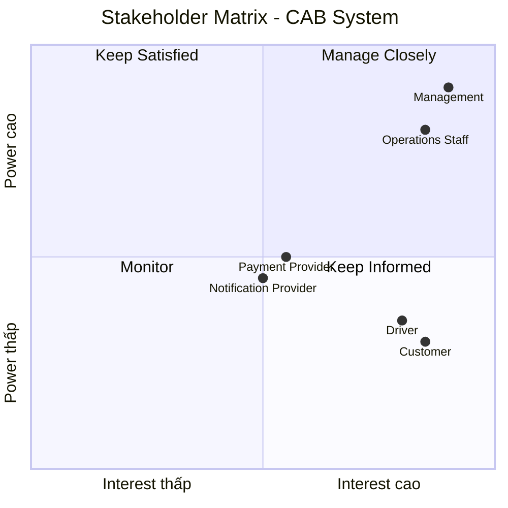
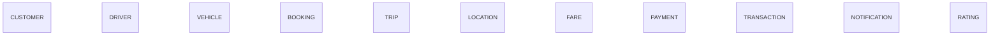

1. Đọc và phân tích yêu cầu sơ khởi của khách hàng ở giai đoạn 1  
1.1 Business Context (Ngữ cảnh nghiệp vụ)
Công ty ABC là doanh nghiệp cung cấp dịch vụ đặt xe trực tuyến.
Hiện tại khách hàng có thể:
- Liên hệ tổng đài để yêu cầu xe.
- Hoặc sử dụng một ứng dụng đơn giản để yêu cầu xe.
- Doanh nghiệp muốn xây dựng hệ thống CAB System – Nền tảng đặt xe với thời gian xây dựng và triển khai là 7 tuần.
- Ban lãnh đạo mong muốn xây dựng một nền tảng CAB mới có khả năng:
- Phục vụ số lượng lớn khách hàng và tài xế.
- Có thể phát triển thêm các tính năng trong tương lai. 
1.2 Business Problem (Vấn đề của nghiệp vụ)
Hệ thống hiện tại đang gặp các vấn đề sau:
- Việc phân công tài xế chủ yếu được thực hiện thủ công.
- Khách hàng khó theo dõi trạng thái chuyến đi.
- Thông tin thanh toán chưa được quản lý tập trung.
- Bộ phận vận hành gặp khó khăn khi muốn mở rộng hệ thống.

2. lập bảng xác định Stakeholders , lập ma trận Stakeholders matrix nêu ra tầm ảnh hưởng (bằng mermaid)
## 2. Stakeholders

| Stakeholder | Vai trò |
|--------------|----------|
| **Khách hàng** | - Đăng ký và đăng nhập tài khoản. - Cập nhật thông tin cá nhân. - Nhập điểm đón, điểm đến và lựa chọn loại xe. - Gửi yêu cầu đặt xe và theo dõi chuyến đi. - Xem lịch sử chuyến đi, số tiền phải trả và đánh giá tài xế sau chuyến. |
| **Tài xế** | - Đăng ký hoặc được tạo tài khoản. - Cập nhật hồ sơ, thông tin phương tiện và trạng thái hoạt động. - Chuyển sang trạng thái sẵn sàng nhận chuyến. - Chấp nhận hoặc từ chối chuyến. - Cập nhật trạng thái chuyến đi. - Cung cấp thông tin vị trí để hệ thống hỗ trợ tìm tài xế phù hợp. |
| **Nhân viên vận hành** | - Quản lý khách hàng, tài xế, phương tiện và chuyến đi. - Theo dõi các chuyến đang diễn ra. - Kiểm tra trạng thái tài xế. - Hỗ trợ xử lý các chuyến bị lỗi. - Tra cứu lịch sử giao dịch. - Thực hiện các chức năng quản trị theo phân quyền. |
| **Ban lãnh đạo / Ban giám đốc** | - Mong muốn xây dựng nền tảng CAB mới. - Phục vụ số lượng lớn khách hàng và tài xế. - Mở rộng tính năng trong tương lai. - Theo dõi báo cáo về số lượng chuyến, doanh thu, tỷ lệ hoàn thành, tỷ lệ hủy và hiệu quả hoạt động của tài xế. |
| **Doanh nghiệp (Công ty ABC)** | - Đơn vị sở hữu hệ thống. - Đưa ra các yêu cầu về tìm tài xế, thanh toán, thông báo, quản trị, khả năng mở rộng, bảo mật và kiến trúc hệ thống. |
| **Nhà cung cấp thanh toán bên ngoài** | - Cung cấp dịch vụ thanh toán điện tử để hệ thống CAB tích hợp. - Không lưu trực tiếp thông tin nhạy cảm của thẻ hoặc tài khoản thanh toán trong hệ thống CAB. |

3. Xác định business goal

|     ID    | Business Goal                            | Mục đích                                                                                                                                                                |
| :-------: | ---------------------------------------- | ----------------------------------------------------------------------------------------------------------------------------------------------------------------------- |
| **BG-01** | Xây dựng nền tảng CAB mới                | Thay thế hệ thống hiện tại bằng nền tảng có khả năng phục vụ số lượng lớn khách hàng và tài xế. Cho phép mở rộng thêm các tính năng trong tương lai.                 |
| **BG-02** | Hỗ trợ đầy đủ quy trình đặt xe           | Đáp ứng toàn bộ quy trình từ tạo yêu cầu, tìm và phân công tài xế, thực hiện chuyến đi, tính cước, thanh toán, thông báo đến đánh giá sau chuyến.                       |
| **BG-03** | Cải thiện quy trình phân công tài xế     | Ưu tiên tài xế phù hợp và gần khách hàng. Tự động tìm tài xế khác khi tài xế từ chối hoặc không phản hồi. Thông báo khi không tìm được tài xế.                    |
| **BG-04** | Quản lý thanh toán an toàn               | Hỗ trợ thanh toán tiền mặt và điện tử. Tích hợp với nhà cung cấp thanh toán bên ngoài. Không lưu trực tiếp thông tin nhạy cảm của thẻ hoặc tài khoản thanh toán.  |
| **BG-05** | Cung cấp hệ thống thông báo              | Thông báo các sự kiện của chuyến đi cho khách hàng và tài xế. Cho phép mở rộng thêm các kênh thông báo trong tương lai.                                              |
| **BG-06** | Hỗ trợ quản trị và theo dõi hoạt động    | Quản lý khách hàng, tài xế, phương tiện và chuyến đi. Tra cứu lịch sử giao dịch và cung cấp báo cáo phục vụ quản lý.                                                 |
| **BG-07** | Đảm bảo khả năng mở rộng và tính ổn định | Hệ thống hoạt động ổn định khi tải tăng. Các thành phần có thể mở rộng độc lập và triển khai chức năng mới từng phần.                                                |
| **BG-08** | Đảm bảo bảo mật và kiểm soát truy cập    | Xác thực người dùng. Kiểm soát quyền truy cập. Bảo vệ dữ liệu và lưu vết các thao tác quan trọng.                                                                 |
| **BG-09** | Xây dựng hệ thống có kiến trúc linh hoạt | Cho phép bổ sung loại dịch vụ mới, phương thức thanh toán, nhà cung cấp thông báo hoặc thay đổi thành phần kỹ thuật mà không phải xây dựng lại toàn bộ ứng dụng.        |

4. xác định phạm vi yêu cầu
### 4.1 In Scope (MVP)

| Module | Description |
|--------|-------------|
| Customer Management | Đăng ký, đăng nhập, cập nhật thông tin khách hàng. |
| Driver Management | Quản lý tài khoản, hồ sơ, phương tiện và trạng thái tài xế. |
| Ride Booking | Tạo yêu cầu đặt xe, chọn loại xe, nhập điểm đón và điểm đến. |
| Driver Matching | Tìm và phân công tài xế phù hợp. |
| Trip Management | Theo dõi và cập nhật trạng thái chuyến đi. |
| Payment | Tính cước và hỗ trợ thanh toán. |
| Notification | Gửi thông báo cho khách hàng và tài xế. |
| Administration | Quản lý khách hàng, tài xế, phương tiện và chuyến đi. |
| Reporting | Báo cáo doanh thu và hoạt động. |
| Security | Xác thực, phân quyền và bảo vệ dữ liệu. |

### 4.2 Out of Scope

- Bổ sung các loại dịch vụ mới.
- Thêm phương thức thanh toán mới.
- Thêm nhà cung cấp thông báo.
- Thay đổi các thành phần kỹ thuật của hệ thống.
- Chi tiết cách tính cước (chưa được chốt).
- Tiêu chí ưu tiên tài xế (chưa được chốt).
- Thời gian tài xế phải phản hồi (chưa được chốt).
- Chính sách hủy chuyến (chưa được chốt).
- Cách xử lý khi mất kết nối mạng (chưa được chốt).
- Thời gian lưu trữ dữ liệu (chưa được chốt).

5. Chuyển các yêu cầu thành Business requirement
   ## 5. Business Requirements

| Mã hiệu | Tên | Diễn giải |
|:-------:|------|-----------|
| BR-01 | Nền tảng CAB | Hệ thống phải được xây dựng thành một nền tảng CAB có khả năng phục vụ số lượng lớn khách hàng và tài xế, đồng thời hỗ trợ mở rộng thêm các tính năng trong tương lai. |
| BR-02 | Quy trình đặt xe | Hệ thống phải hỗ trợ toàn bộ quy trình từ khi khách hàng tạo yêu cầu đặt xe, tìm và phân công tài xế, thực hiện chuyến đi, tính cước, thanh toán, thông báo đến đánh giá sau chuyến. |
| BR-03 | Quản lý vận hành | Hệ thống phải hỗ trợ quản lý khách hàng, tài xế, phương tiện và chuyến đi; cho phép theo dõi hoạt động và cung cấp báo cáo phục vụ công tác quản lý. |
| BR-04 | Khả năng mở rộng | Hệ thống phải hoạt động ổn định khi nhu cầu tăng cao, cho phép các thành phần mở rộng độc lập và triển khai chức năng mới từng phần mà hạn chế ảnh hưởng đến hệ thống đang hoạt động. |
| BR-05 | Bảo mật và kiểm soát truy cập | Hệ thống phải xác thực người dùng, kiểm soát quyền truy cập, bảo vệ dữ liệu và lưu vết các thao tác quan trọng. |
| BR-06 | Kiến trúc linh hoạt | Hệ thống phải có kiến trúc đủ linh hoạt để bổ sung loại dịch vụ mới, phương thức thanh toán, nhà cung cấp thông báo hoặc thay đổi một số thành phần kỹ thuật mà không phải xây dựng lại toàn bộ ứng dụng. |

6. Xây dựng các Business process  
  # Business Process

## BP01 - Customer Account Process

| Step | Actor | Business Activity | System / Result |
|---:|---|---|---|
| 1 | Khách hàng | Đăng ký tài khoản | Tài khoản khách hàng |
| 2 | Khách hàng | Đăng nhập | Khách hàng sử dụng chức năng yêu cầu tài khoản |
| 3 | Khách hàng | Cập nhật thông tin cá nhân | Thông tin cá nhân được cập nhật |

## BP02 - Booking Process

| Step | Actor | Business Activity | System / Result |
|---:|---|---|---|
| 1 | Khách hàng | Nhập điểm đón | Điểm đón được cung cấp |
| 2 | Khách hàng | Nhập điểm đến | Điểm đến được cung cấp |
| 3 | Khách hàng | Lựa chọn loại xe | Loại xe được lựa chọn |
| 4 | Khách hàng | Gửi yêu cầu đặt xe | Yêu cầu đặt xe được tạo |
| 5 | Hệ thống | Tiếp nhận yêu cầu | Hệ thống tiếp nhận yêu cầu |
| 6 | Hệ thống | Thông báo | Khách hàng nhận thông báo yêu cầu đã được tiếp nhận |

## BP03 - Driver Matching & Assignment Process

| Step | Actor | Business Activity | System / Result |
|---:|---|---|---|
| 1 | Hệ thống | Xác định tài xế phù hợp | Danh sách tài xế phù hợp |
| 2 | Hệ thống | Xem xét vị trí | Xác định tài xế dựa trên vị trí |
| 3 | Hệ thống | Xem xét trạng thái sẵn sàng | Xác định tài xế đang sẵn sàng |
| 4 | Hệ thống | Áp dụng tiêu chí vận hành | Xác định tài xế phù hợp |
| 5 | Hệ thống | Ưu tiên tài xế | Ưu tiên tài xế phù hợp và gần khách hàng |
| 6 | Hệ thống | Gửi yêu cầu cho tài xế | Tài xế nhận được thông báo |
| 7 | Tài xế | Chấp nhận / từ chối | Tài xế phản hồi yêu cầu |
| 8 | Hệ thống | Xử lý từ chối / không phản hồi | Tiếp tục tìm tài xế khác |
| 9 | Hệ thống | Không tìm được tài xế | Thông báo rõ ràng cho khách hàng |
| 10 | Hệ thống | Phân công tài xế | Tài xế nhận chuyến |

## BP04 - Trip Execution & Tracking Process

| Step | Actor | Business Activity | System / Result |
|---:|---|---|---|
| 1 | Tài xế | Nhận chuyến | Tài xế thực hiện chuyến |
| 2 | Tài xế | Đến điểm đón | Cập nhật trạng thái đã đến điểm đón |
| 3 | Tài xế | Đón khách | Cập nhật trạng thái đã đón khách |
| 4 | Tài xế | Di chuyển | Cập nhật trạng thái đang di chuyển |
| 5 | Tài xế | Hoàn thành chuyến | Chuyến đi hoàn thành |
| 6 | Khách hàng | Theo dõi chuyến | Theo dõi tài xế, thời gian dự kiến đến và trạng thái chuyến |

## BP05 - Fare Calculation & Payment Process

| Step | Actor | Business Activity | System / Result |
|---:|---|---|---|
| 1 | Hệ thống | Tính cước | Xác định số tiền khách hàng phải trả |
| 2 | Khách hàng | Chọn phương thức thanh toán | Tiền mặt hoặc phương thức điện tử |
| 3 | Khách hàng | Thanh toán | Thực hiện thanh toán |
| 4 | Hệ thống | Xử lý thanh toán điện tử | Gửi giao dịch tới nhà cung cấp thanh toán bên ngoài |
| 5 | Hệ thống | Nhận kết quả thanh toán | Xác định kết quả giao dịch |
| 6 | Hệ thống | Thông báo kết quả | Khách hàng nhận kết quả thanh toán |
| 7 | Hệ thống | Xử lý thanh toán thất bại | Cho phép xử lý lại theo chính sách của doanh nghiệp |

## BP06 - Notification Process

| Step | Actor | Business Activity | Notification |
|---:|---|---|---|
| 1 | Hệ thống | Yêu cầu được tiếp nhận | Thông báo khách hàng |
| 2 | Hệ thống | Tài xế nhận chuyến | Thông báo khách hàng |
| 3 | Hệ thống | Tài xế đến điểm đón | Thông báo khách hàng |
| 4 | Hệ thống | Chuyến hoàn thành | Thông báo khách hàng |
| 5 | Hệ thống | Thanh toán có kết quả | Thông báo khách hàng |
| 6 | Hệ thống | Có chuyến mới | Thông báo tài xế |
| 7 | Hệ thống | Có thay đổi liên quan chuyến đang thực hiện | Thông báo tài xế |

## BP07 - Rating & Trip History Process

| Step | Actor | Business Activity | System / Result |
|---:|---|---|---|
| 1 | Khách hàng | Xem lịch sử chuyến đi | Hiển thị lịch sử chuyến |
| 2 | Khách hàng | Xem số tiền phải trả | Hiển thị số tiền |
| 3 | Khách hàng | Đánh giá tài xế | Ghi nhận đánh giá tài xế |

## BP08 - Driver Management Process

| Step | Actor | Business Activity | System / Result |
|---:|---|---|---|
| 1 | Tài xế / Nhân viên vận hành | Tạo tài khoản tài xế | Tài khoản tài xế |
| 2 | Tài xế | Cập nhật hồ sơ | Hồ sơ tài xế |
| 3 | Tài xế | Cập nhật thông tin phương tiện | Thông tin phương tiện |
| 4 | Tài xế | Cập nhật trạng thái hoạt động | Trạng thái hoạt động |
| 5 | Tài xế | Chuyển sang sẵn sàng nhận chuyến | Tài xế sẵn sàng nhận chuyến |

## BP09 - Operation Management Process

| Step | Actor | Business Activity | Result |
|---:|---|---|---|
| 1 | Nhân viên vận hành | Quản lý khách hàng | Quản lý thông tin khách hàng |
| 2 | Nhân viên vận hành | Quản lý tài xế | Quản lý thông tin tài xế |
| 3 | Nhân viên vận hành | Quản lý phương tiện | Quản lý phương tiện |
| 4 | Nhân viên vận hành | Quản lý chuyến đi | Quản lý chuyến đi |
| 5 | Nhân viên vận hành | Xem chuyến đang diễn ra | Theo dõi chuyến |
| 6 | Nhân viên vận hành | Kiểm tra trạng thái tài xế | Theo dõi trạng thái tài xế |
| 7 | Nhân viên vận hành | Xử lý chuyến bị lỗi | Hỗ trợ xử lý trường hợp lỗi |
| 8 | Nhân viên vận hành | Tra cứu lịch sử giao dịch | Tra cứu giao dịch |

## BP10 - Reporting Process

| Step | Actor | Business Activity | Report |
|---:|---|---|---|
| 1 | Nhân viên vận hành / Ban lãnh đạo | Xem báo cáo | Báo cáo số lượng chuyến |
| 2 | Nhân viên vận hành / Ban lãnh đạo | Xem báo cáo | Báo cáo doanh thu |
| 3 | Nhân viên vận hành / Ban lãnh đạo | Xem báo cáo | Tỷ lệ chuyến hoàn thành |
| 4 | Nhân viên vận hành / Ban lãnh đạo | Xem báo cáo | Tỷ lệ hủy |
| 5 | Nhân viên vận hành / Ban lãnh đạo | Xem báo cáo | Hiệu quả hoạt động của tài xế |

7. Thiết kế phân rã yêu cầu nghiệp vụ
## 7. Thiết kế phân rã yêu cầu nghiệp vụ 
## Business Requirement Decomposition 

| ID | Business Requirement | Sub Requirement | FR | Description | 
|---|---|---|---|---| 
| BR01 | Quản lý khách hàng | BR01.1 Đăng ký tài khoản | FR01 | Khách hàng đăng ký tài khoản | 
| BR01 | Quản lý khách hàng | BR01.2 Đăng nhập | FR02 | Khách hàng đăng nhập | 
| BR01 | Quản lý khách hàng | BR01.3 Cập nhật thông tin cá nhân | FR03 | Khách hàng cập nhật thông tin cá nhân | 
| BR02 | Đặt xe | BR02.1 Nhập điểm đón | FR04 | Khách hàng nhập điểm đón | 
| BR02 | Đặt xe | BR02.2 Nhập điểm đến | FR05 | Khách hàng nhập điểm đến | 
| BR02 | Đặt xe | BR02.3 Lựa chọn loại xe | FR06 | Khách hàng lựa chọn loại xe | 
| BR02 | Đặt xe | BR02.4 Gửi yêu cầu đặt xe | FR07 | Khách hàng gửi yêu cầu đặt xe | 
| BR02 | Đặt xe | BR02.5 Theo dõi yêu cầu/chuyến đi | FR08 | Khách hàng theo dõi tài xế, thời gian dự kiến đến và trạng thái chuyến | 
| BR03 | Tìm kiếm và phân công tài xế | BR03.1 Xác định tài xế phù hợp | FR09 | Hệ thống xác định tài xế phù hợp | 
| BR03 | Tìm kiếm và phân công tài xế | BR03.2 Xem xét vị trí tài xế | FR10 | Xác định tài xế dựa trên vị trí | 
| BR03 | Tìm kiếm và phân công tài xế | BR03.3 Xem xét trạng thái sẵn sàng | FR11 | Xác định tài xế dựa trên trạng thái sẵn sàng | 
| BR03 | Tìm kiếm và phân công tài xế | BR03.4 Ưu tiên tài xế phù hợp và gần khách hàng | FR12 | Hệ thống ưu tiên tài xế phù hợp và gần khách hàng | 
| BR03 | Tìm kiếm và phân công tài xế | BR03.5 Gửi yêu cầu cho tài xế | FR13 | Tài xế nhận được thông báo về yêu cầu | 
| BR03 | Tìm kiếm và phân công tài xế | BR03.6 Xử lý tài xế từ chối | FR14 | Hệ thống tiếp tục tìm tài xế khác | 
| BR03 | Tìm kiếm và phân công tài xế | BR03.7 Xử lý tài xế không phản hồi | FR15 | Hệ thống tiếp tục tìm tài xế khác | 
| BR03 | Tìm kiếm và phân công tài xế | BR03.8 Thông báo khi không tìm được tài xế | FR16 | Thông báo rõ ràng cho khách hàng | 
| BR04 | Thực hiện và theo dõi chuyến đi | BR04.1 Cập nhật đã đến điểm đón | FR17 | Tài xế cập nhật trạng thái đã đến điểm đón | 
| BR04 | Thực hiện và theo dõi chuyến đi | BR04.2 Cập nhật đã đón khách | FR18 | Tài xế cập nhật trạng thái đã đón khách | 
| BR04 | Thực hiện và theo dõi chuyến đi | BR04.3 Cập nhật đang di chuyển | FR19 | Tài xế cập nhật trạng thái đang di chuyển | 
| BR04 | Thực hiện và theo dõi chuyến đi | BR04.4 Cập nhật hoàn thành chuyến | FR20 | Tài xế cập nhật trạng thái hoàn thành chuyến | 
| BR04 | Thực hiện và theo dõi chuyến đi | BR04.5 Theo dõi trạng thái chuyến | FR21 | Khách hàng theo dõi trạng thái hiện tại của chuyến | 
| BR05 | Tính cước và thanh toán | BR05.1 Xác định số tiền phải trả | FR22 | Hệ thống xác định số tiền phải trả dựa trên loại dịch vụ và thông tin chuyến đi | 
| BR05 | Tính cước và thanh toán | BR05.2 Thanh toán tiền mặt | FR23 | Khách hàng có thể thanh toán bằng tiền mặt | 
| BR05 | Tính cước và thanh toán | BR05.3 Thanh toán điện tử | FR24 | Khách hàng có thể thanh toán bằng phương thức thanh toán điện tử | 
| BR05 | Tính cước và thanh toán | BR05.4 Tích hợp nhà cung cấp thanh toán bên ngoài | FR25 | Hệ thống tích hợp với nhà cung cấp thanh toán bên ngoài | 
| BR05 | Tính cước và thanh toán | BR05.5 Xử lý thanh toán điện tử thất bại | FR26 | Thông báo khách hàng và cho phép xử lý lại theo chính sách doanh nghiệp | 
| BR06 | Thông báo | BR06.1 Thông báo tiếp nhận yêu cầu | FR27 | Khách hàng nhận thông báo khi yêu cầu đặt xe được tiếp nhận | 
| BR06 | Thông báo | BR06.2 Thông báo tài xế nhận chuyến | FR28 | Khách hàng nhận thông báo khi tài xế nhận chuyến | 
| BR06 | Thông báo | BR06.3 Thông báo tài xế đến điểm đón | FR29 | Khách hàng nhận thông báo khi tài xế đến điểm đón | 
| BR06 | Thông báo | BR06.4 Thông báo chuyến hoàn thành | FR30 | Khách hàng nhận thông báo khi chuyến hoàn thành | 
| BR06 | Thông báo | BR06.5 Thông báo kết quả thanh toán | FR31 | Khách hàng nhận thông báo khi thanh toán có kết quả | 
| BR06 | Thông báo | BR06.6 Thông báo chuyến mới cho tài xế | FR32 | Tài xế nhận thông báo về chuyến mới | 
| BR06 | Thông báo | BR06.7 Thông báo thay đổi liên quan đến chuyến | FR33 | Tài xế nhận thông báo về những thay đổi liên quan đến chuyến đang thực hiện | 
| BR07 | Lịch sử và đánh giá | BR07.1 Xem lịch sử chuyến đi | FR34 | Khách hàng xem lịch sử chuyến đi | 
| BR07 | Lịch sử và đánh giá | BR07.2 Xem số tiền phải trả | FR35 | Khách hàng xem số tiền phải trả | 
| BR07 | Lịch sử và đánh giá | BR07.3 Đánh giá tài xế | FR36 | Khách hàng đánh giá tài xế sau khi hoàn thành chuyến | 
| BR08 | Quản lý tài xế và phương tiện | BR08.1 Đăng ký tài xế | FR37 | Tài xế có thể đăng ký | 
| BR08 | Quản lý tài xế và phương tiện | BR08.2 Nhân viên vận hành tạo tài khoản tài xế | FR38 | Nhân viên vận hành có thể tạo tài khoản tài xế | 
| BR08 | Quản lý tài xế và phương tiện | BR08.3 Cập nhật hồ sơ tài xế | FR39 | Tài xế cập nhật hồ sơ | 
| BR08 | Quản lý tài xế và phương tiện | BR08.4 Cập nhật thông tin phương tiện | FR40 | Tài xế cập nhật thông tin phương tiện | 
| BR08 | Quản lý tài xế và phương tiện | BR08.5 Cập nhật trạng thái hoạt động | FR41 | Tài xế cập nhật trạng thái hoạt động | 
| BR08 | Quản lý tài xế và phương tiện | BR08.6 Chuyển sang trạng thái sẵn sàng nhận chuyến | FR42 | Tài xế chuyển sang trạng thái sẵn sàng nhận chuyến | 
| BR09 | Quản lý vận hành | BR09.1 Quản lý khách hàng | FR43 | Nhân viên vận hành quản lý khách hàng | 
| BR09 | Quản lý vận hành | BR09.2 Quản lý tài xế | FR44 | Nhân viên vận hành quản lý tài xế | 
| BR09 | Quản lý vận hành | BR09.3 Quản lý phương tiện | FR45 | Nhân viên vận hành quản lý phương tiện | 
| BR09 | Quản lý vận hành | BR09.4 Quản lý chuyến đi | FR46 | Nhân viên vận hành quản lý chuyến đi | 
| BR09 | Quản lý vận hành | BR09.5 Xem chuyến đang diễn ra | FR47 | Nhân viên vận hành xem các chuyến đang diễn ra | 
| BR09 | Quản lý vận hành | BR09.6 Kiểm tra trạng thái tài xế | FR48 | Nhân viên vận hành kiểm tra trạng thái tài xế | 
| BR09 | Quản lý vận hành | BR09.7 Xử lý chuyến bị lỗi | FR49 | Nhân viên vận hành hỗ trợ xử lý các trường hợp chuyến bị lỗi | 
| BR09 | Quản lý vận hành | BR09.8 Tra cứu lịch sử giao dịch | FR50 | Nhân viên vận hành tra cứu lịch sử giao dịch | 
| BR10 | Báo cáo | BR10.1 Báo cáo số lượng chuyến | FR51 | Báo cáo số lượng chuyến | 
| BR10 | Báo cáo | BR10.2 Báo cáo doanh thu | FR52 | Báo cáo doanh thu | 
| BR10 | Báo cáo | BR10.3 Báo cáo tỷ lệ chuyến hoàn thành | FR53 | Báo cáo tỷ lệ chuyến hoàn thành | 
| BR10 | Báo cáo | BR10.4 Báo cáo tỷ lệ hủy | FR54 | Báo cáo tỷ lệ hủy | 
| BR10 | Báo cáo | BR10.5 Báo cáo hiệu quả hoạt động của tài xế | FR55 | Báo cáo hiệu quả hoạt động của tài xế |

8. xây dựng business rule và acept
## Business Rules

| ID | Business Rule | Nội dung |
|---|---|---|
| BR-01 | Xác thực tài khoản | Khách hàng và tài xế phải được xác thực trước khi sử dụng các chức năng yêu cầu tài khoản. |
| BR-02 | Phân quyền quản trị | Các thao tác quản trị phải được kiểm soát quyền truy cập. |
| BR-03 | Xác định tài xế phù hợp | Hệ thống xác định tài xế phù hợp dựa trên vị trí, trạng thái sẵn sàng và một số tiêu chí vận hành khác. |
| BR-04 | Ưu tiên tài xế | Hệ thống ưu tiên tài xế phù hợp và gần khách hàng. |
| BR-05 | Tìm tài xế thay thế | Nếu tài xế được đề xuất không phản hồi hoặc từ chối, hệ thống tiếp tục tìm tài xế khác mà không yêu cầu khách hàng tạo lại yêu cầu. |
| BR-06 | Không tìm được tài xế | Nếu không tìm được tài xế, khách hàng phải được thông báo rõ ràng. |
| BR-07 | Cập nhật trạng thái chuyến | Tài xế cập nhật trạng thái chuyến gồm đã đến điểm đón, đã đón khách, đang di chuyển và hoàn thành chuyến. |
| BR-08 | Tính cước | Sau khi chuyến đi hoàn thành, hệ thống xác định số tiền khách hàng phải trả dựa trên loại dịch vụ và thông tin chuyến đi. |
| BR-09 | Phương thức thanh toán | Khách hàng có thể thanh toán bằng tiền mặt hoặc phương thức thanh toán điện tử. |
| BR-10 | Thanh toán bên ngoài | Thanh toán điện tử được tích hợp với nhà cung cấp thanh toán bên ngoài. |
| BR-11 | Không lưu thông tin thanh toán nhạy cảm | Thông tin nhạy cảm của thẻ hoặc tài khoản thanh toán không được lưu trực tiếp trong hệ thống CAB. |
| BR-12 | Thanh toán thất bại | Nếu giao dịch thanh toán điện tử thất bại, hệ thống thông báo cho khách hàng và cho phép xử lý lại theo chính sách của doanh nghiệp. |
| BR-13 | Thông báo cho khách hàng | Khách hàng nhận thông báo khi yêu cầu được tiếp nhận, tài xế nhận chuyến, tài xế đến điểm đón, chuyến hoàn thành và thanh toán có kết quả. |
| BR-14 | Thông báo cho tài xế | Tài xế nhận thông báo về các chuyến mới hoặc những thay đổi liên quan đến chuyến đang thực hiện. |
| BR-15 | Lưu vết thao tác | Các thao tác quan trọng phải được lưu vết để phục vụ kiểm tra khi có sự cố. |
| BR-16 | Bảo vệ dữ liệu | Thông tin cá nhân, thông tin phương tiện, dữ liệu vị trí và dữ liệu giao dịch phải được bảo vệ. |

## Acceptance Criteria

| ID | Requirement | Acceptance Criteria |
|---|---|---|
| AC-01 | Đăng ký / đăng nhập | Khách hàng có thể đăng ký tài khoản và đăng nhập hệ thống. |
| AC-02 | Cập nhật thông tin | Khách hàng có thể cập nhật thông tin cá nhân. |
| AC-03 | Tạo yêu cầu đặt xe | Khách hàng có thể nhập điểm đón, điểm đến, lựa chọn loại xe và gửi yêu cầu đặt xe. |
| AC-04 | Tiếp nhận yêu cầu | Khi yêu cầu đặt xe được gửi, hệ thống tiếp nhận yêu cầu và thông báo cho khách hàng. |
| AC-05 | Tìm tài xế | Hệ thống xác định tài xế phù hợp dựa trên vị trí, trạng thái sẵn sàng và các tiêu chí vận hành khác. |
| AC-06 | Ưu tiên tài xế | Hệ thống ưu tiên tài xế phù hợp và gần khách hàng. |
| AC-07 | Tài xế từ chối | Khi tài xế từ chối chuyến, hệ thống tiếp tục tìm tài xế khác mà không yêu cầu khách hàng tạo lại yêu cầu. |
| AC-08 | Tài xế không phản hồi | Khi tài xế không phản hồi, hệ thống tiếp tục tìm tài xế khác. |
| AC-09 | Không tìm được tài xế | Khi không tìm được tài xế, khách hàng nhận được thông báo rõ ràng. |
| AC-10 | Theo dõi chuyến | Khách hàng có thể biết tài xế đã nhận chuyến, thời gian dự kiến tài xế đến và trạng thái hiện tại của chuyến. |
| AC-11 | Cập nhật trạng thái chuyến | Tài xế có thể cập nhật trạng thái đã đến điểm đón, đã đón khách, đang di chuyển và hoàn thành chuyến. |
| AC-12 | Tính cước | Sau khi chuyến hoàn thành, hệ thống xác định số tiền khách hàng phải trả dựa trên loại dịch vụ và thông tin chuyến đi. |
| AC-13 | Thanh toán | Khách hàng có thể thanh toán bằng tiền mặt hoặc phương thức thanh toán điện tử. |
| AC-14 | Thanh toán điện tử | Hệ thống có thể tích hợp với nhà cung cấp thanh toán bên ngoài và không lưu trực tiếp thông tin nhạy cảm của thẻ hoặc tài khoản thanh toán. |
| AC-15 | Thanh toán thất bại | Khi thanh toán điện tử thất bại, hệ thống thông báo cho khách hàng và cho phép xử lý lại theo chính sách của doanh nghiệp. |
| AC-16 | Thông báo khách hàng | Khách hàng nhận được các thông báo về tiếp nhận yêu cầu, tài xế nhận chuyến, tài xế đến điểm đón, chuyến hoàn thành và kết quả thanh toán. |
| AC-17 | Thông báo tài xế | Tài xế nhận được thông báo về chuyến mới và những thay đổi liên quan đến chuyến đang thực hiện. |
| AC-18 | Lịch sử chuyến | Khách hàng có thể xem lịch sử chuyến đi và số tiền phải trả. |
| AC-19 | Đánh giá | Sau khi hoàn thành chuyến, khách hàng có thể đánh giá tài xế. |
| AC-20 | Quản lý vận hành | Nhân viên vận hành có thể quản lý khách hàng, tài xế, phương tiện và chuyến đi. |
| AC-21 | Giám sát vận hành | Nhân viên vận hành có thể xem chuyến đang diễn ra và kiểm tra trạng thái tài xế. |
| AC-22 | Xử lý chuyến lỗi | Nhân viên vận hành có thể hỗ trợ xử lý các trường hợp chuyến bị lỗi. |
| AC-23 | Tra cứu giao dịch | Nhân viên vận hành có thể tra cứu lịch sử giao dịch. |
| AC-24 | Báo cáo | Hệ thống cung cấp báo cáo về số lượng chuyến, doanh thu, tỷ lệ chuyến hoàn thành, tỷ lệ hủy và hiệu quả hoạt động của tài xế. |

9. xây dựng các modeling data, xác định được các thực thể để vẽ sơ đồ ERD
   ## Data Modeling

### Entity Identification

The following entities are identified from the business requirements:

| Entity | Description |
|---|---|
| Customer | Customer account and personal information |
| Driver | Driver account, profile and operating status |
| Vehicle | Vehicle information |
| Booking | Customer booking request |
| Trip | Trip information and status |
| Location | Driver location, pickup point and destination |
| Fare | Amount to be paid for the trip |
| Payment | Payment method and payment result |
| Transaction | Transaction and transaction history |
| Notification | Notification information |
| Rating | Driver rating |

## Entity Relationship Diagram

10. XÁC ĐỊNH NON FUNCTIONAL REQUIREMENT
## Non-Functional Requirements

| ID | Category | Non-Functional Requirement |
|---|---|---|
| NFR-01 | Stability | Hệ thống phải hoạt động ổn định vào các thời điểm nhu cầu tăng cao. |
| NFR-02 | Fault Isolation | Lỗi xảy ra ở chức năng thanh toán hoặc thông báo không được làm cho toàn bộ hệ thống đặt xe ngừng hoạt động. |
| NFR-03 | Scalability | Các thành phần của hệ thống cần có khả năng mở rộng độc lập khi tải tăng. |
| NFR-04 | Deployability | Các chức năng mới có thể được triển khai từng phần và hạn chế ảnh hưởng đến các chức năng đang hoạt động. |
| NFR-05 | Authentication | Khách hàng và tài xế phải được xác thực trước khi sử dụng các chức năng yêu cầu tài khoản. |
| NFR-06 | Authorization | Các thao tác quản trị phải được kiểm soát quyền truy cập. |
| NFR-07 | Data Protection | Thông tin cá nhân, thông tin phương tiện, dữ liệu vị trí và dữ liệu giao dịch phải được bảo vệ. |
| NFR-08 | Auditability | Hệ thống cần lưu vết các thao tác quan trọng để phục vụ kiểm tra khi có sự cố. |
| NFR-09 | Extensibility | Kiến trúc phải đủ linh hoạt để có thể bổ sung các loại dịch vụ mới trong tương lai. |
| NFR-10 | Payment Extensibility | Có thể thêm các phương thức thanh toán mà không phải xây dựng lại toàn bộ ứng dụng. |
| NFR-11 | Notification Extensibility | Có thể thêm nhà cung cấp thông báo mà không phải thay đổi toàn bộ hệ thống. |
| NFR-12 | Technical Flexibility | Có thể thay đổi một số thành phần kỹ thuật mà không phải xây dựng lại toàn bộ ứng dụng. |

11. XÁC ĐỊNH VÀ VẼ CÁC USE CASE
    ## Use Case Diagram

```mermaid
flowchart LR

    Customer[Customer]
    Driver[Driver]
    Staff[Operations Staff]

    subgraph CAB System

        C1((Đăng ký tài khoản))
        C2((Đăng nhập))
        C3((Cập nhật thông tin cá nhân))
        C4((Đặt xe))
        C5((Theo dõi chuyến đi))
        C6((Xem lịch sử chuyến đi))
        C7((Thanh toán))
        C8((Đánh giá tài xế))

        D1((Đăng ký / cập nhật hồ sơ))
        D2((Cập nhật thông tin phương tiện))
        D3((Cập nhật trạng thái hoạt động))
        D4((Nhận và xử lý yêu cầu chuyến))
        D5((Cập nhật trạng thái chuyến))

        O1((Quản lý khách hàng))
        O2((Quản lý tài xế))
        O3((Quản lý phương tiện))
        O4((Quản lý chuyến đi))
        O5((Theo dõi chuyến và trạng thái tài xế))
        O6((Xử lý chuyến bị lỗi))
        O7((Tra cứu lịch sử giao dịch))
        O8((Xem báo cáo))

    end

    Customer --- C1
    Customer --- C2
    Customer --- C3
    Customer --- C4
    Customer --- C5
    Customer --- C6
    Customer --- C7
    Customer --- C8

    Driver --- D1
    Driver --- D2
    Driver --- D3
    Driver --- D4
    Driver --- D5

    Staff --- O1
    Staff --- O2
    Staff --- O3
    Staff --- O4
    Staff --- O5
    Staff --- O6
    Staff --- O7
    Staff --- O8
```

12. ĐẶC TẢ USE CASE
## Use Case Specification

### UC-C04 — Đặt xe

| Thành phần | Nội dung |
|---|---|
| Actor | Customer |
| Mục tiêu | Gửi yêu cầu đặt xe |
| Precondition | Customer đã đăng nhập |
| Main Flow | 1. Nhập điểm đón và điểm đến. 2. Chọn loại xe. 3. Gửi yêu cầu đặt xe. 4. Hệ thống tiếp nhận yêu cầu. 5. Hệ thống tìm tài xế phù hợp. |
| Alternative Flow | Nếu tài xế được đề xuất không phản hồi hoặc từ chối, hệ thống tiếp tục tìm tài xế khác. |
| Exception | Nếu không tìm được tài xế, hệ thống thông báo cho Customer. |
| Postcondition | Yêu cầu đặt xe được tiếp nhận và hệ thống thực hiện tìm tài xế. |

### UC-D07 — Chấp nhận chuyến

| Thành phần | Nội dung |
|---|---|
| Actor | Driver |
| Mục tiêu | Chấp nhận chuyến được đề xuất |
| Precondition | Driver ở trạng thái sẵn sàng và nhận được thông báo chuyến phù hợp |
| Main Flow | 1. Nhận thông báo chuyến. 2. Xem yêu cầu. 3. Chấp nhận chuyến. |
| Alternative Flow | Driver có thể từ chối chuyến. |
| Postcondition | Chuyến được Driver chấp nhận. |

### UC-D09 — Cập nhật trạng thái chuyến

| Thành phần | Nội dung |
|---|---|
| Actor | Driver |
| Mục tiêu | Cập nhật trạng thái trong quá trình thực hiện chuyến |
| Main Flow | Driver cập nhật trạng thái: đã đến điểm đón → đã đón khách → đang di chuyển → hoàn thành chuyến. |
| Postcondition | Trạng thái chuyến được cập nhật. |

### UC-C08 — Thanh toán

| Thành phần | Nội dung |
|---|---|
| Actor | Customer |
| Mục tiêu | Thanh toán số tiền phải trả |
| Precondition | Chuyến đi đã hoàn thành |
| Main Flow | 1. Hệ thống xác định số tiền phải trả. 2. Customer chọn phương thức thanh toán. 3. Thực hiện thanh toán. |
| Alternative Flow | Thanh toán bằng tiền mặt hoặc phương thức thanh toán điện tử. |
| Exception | Nếu thanh toán điện tử thất bại, hệ thống thông báo và cho phép xử lý lại theo chính sách doanh nghiệp. |

### UC-O08 — Xử lý chuyến bị lỗi

| Thành phần | Nội dung |
|---|---|
| Actor | Operations Staff |
| Mục tiêu | Hỗ trợ xử lý trường hợp chuyến bị lỗi |
| Main Flow | Operations Staff xem và hỗ trợ xử lý trường hợp chuyến bị lỗi. |
| Postcondition | Trường hợp chuyến bị lỗi được hỗ trợ xử lý. |

13. XÁC ĐỊNH NHỮNG ACCEPTANCE CRITERIA  "TIÊU CHÍ CHẤP NHẬN" (KHI NÀO NÓ KẾT THÚC VÀ NGHIỆM THU)
## Acceptance Criteria

| ID | Use Case | Acceptance Criteria |
|---|---|---|
| AC-01 | Đăng ký tài khoản | Customer có thể đăng ký tài khoản. |
| AC-02 | Đăng nhập | Customer có thể đăng nhập và sử dụng các chức năng yêu cầu tài khoản. |
| AC-03 | Cập nhật thông tin cá nhân | Customer có thể cập nhật thông tin cá nhân. |
| AC-04 | Đặt xe | Customer nhập điểm đón, điểm đến, chọn loại xe và gửi yêu cầu đặt xe thành công. |
| AC-05 | Theo dõi chuyến đi | Customer có thể biết trạng thái tìm tài xế, tài xế nhận chuyến, thời gian dự kiến đến và trạng thái chuyến. |
| AC-06 | Xem lịch sử chuyến đi | Customer có thể xem lịch sử chuyến đi. |
| AC-07 | Thanh toán | Customer có thể thanh toán bằng tiền mặt hoặc phương thức thanh toán điện tử. |
| AC-08 | Đánh giá tài xế | Customer có thể đánh giá tài xế sau khi chuyến hoàn thành. |
| AC-09 | Đăng ký / cập nhật hồ sơ | Driver có thể đăng ký hoặc được tạo tài khoản và cập nhật hồ sơ. |
| AC-10 | Cập nhật thông tin phương tiện | Driver có thể cập nhật thông tin phương tiện. |
| AC-11 | Cập nhật trạng thái hoạt động | Driver có thể cập nhật trạng thái hoạt động và sẵn sàng nhận chuyến. |
| AC-12 | Nhận và xử lý yêu cầu chuyến | Driver nhận được thông báo chuyến và có thể chấp nhận hoặc từ chối chuyến. |
| AC-13 | Cập nhật trạng thái chuyến | Driver có thể cập nhật trạng thái: đã đến điểm đón → đã đón khách → đang di chuyển → hoàn thành chuyến. |
| AC-14 | Quản lý khách hàng | Operations Staff có thể quản lý khách hàng. |
| AC-15 | Quản lý tài xế | Operations Staff có thể quản lý tài xế. |
| AC-16 | Quản lý phương tiện | Operations Staff có thể quản lý phương tiện. |
| AC-17 | Quản lý chuyến đi | Operations Staff có thể quản lý chuyến đi. |
| AC-18 | Theo dõi chuyến và trạng thái tài xế | Operations Staff có thể xem chuyến đang diễn ra và kiểm tra trạng thái tài xế. |
| AC-19 | Xử lý chuyến bị lỗi | Operations Staff có thể hỗ trợ xử lý các trường hợp chuyến bị lỗi. |
| AC-20 | Tra cứu lịch sử giao dịch | Operations Staff có thể tra cứu lịch sử giao dịch. |
| AC-21 | Xem báo cáo | Hệ thống cung cấp báo cáo về số lượng chuyến, doanh thu, tỷ lệ hoàn thành, tỷ lệ hủy và hiệu quả hoạt động của tài xế. |

14. Requirement Traceability Matrix "TRUY XUẤT NGUỒN GỐC YÊU CẦU" BAO GỒM CÁC CỘT BG, BR, FNR, UC, AC
# Requirement Traceability Matrix

| BG | BR | FNR | UC | AC |
|-----|-----|------|------|------|
| BG-01 | BR-01 | FNR-01 | UC-01 | AC-01 |
| BG-01 | BR-01 | FNR-01 | UC-02 | AC-02 |
| BG-01 | BR-01 | FNR-01 | UC-03 | AC-03 |
| BG-02 | BR-02 | FNR-02 | UC-04 | AC-04 |
| BG-02 | BR-02 | FNR-03 | UC-05 | AC-05 |
| BG-02 | BR-03 | FNR-04 | UC-06 | AC-06 |
| BG-02 | BR-03 | FNR-05 | UC-07 | AC-07 |
| BG-03 | BR-04 | FNR-06 | UC-08 | AC-08 |
| BG-03 | BR-04 | FNR-07 | UC-09 | AC-09 |
| BG-03 | BR-05 | FNR-08 | UC-10 | AC-10 |
| BG-03 | BR-06 | FNR-09 | UC-11 | AC-11 |
| BG-04 | BR-07 | FNR-10 | UC-12 | AC-12 |
| BG-04 | BR-07 | FNR-11 | UC-13 | AC-13 |
| BG-04 | BR-07 | FNR-12 | UC-14 | AC-14 |
| BG-05 | BR-08 | FNR-13 | UC-15 | AC-15 |
| BG-05 | BR-08 | FNR-14 | UC-16 | AC-16 |
| BG-05 | BR-08 | FNR-15 | UC-17 | AC-17 |
| BG-06 | BR-09 | FNR-16 | UC-18 | AC-18 |
| BG-07 | BR-10 | FNR-17 | UC-19 | AC-19 |
| BG-07 | BR-10 | FNR-18 | UC-20 | AC-20 |
| BG-07 | BR-11 | FNR-19 | UC-21 | AC-21 |
