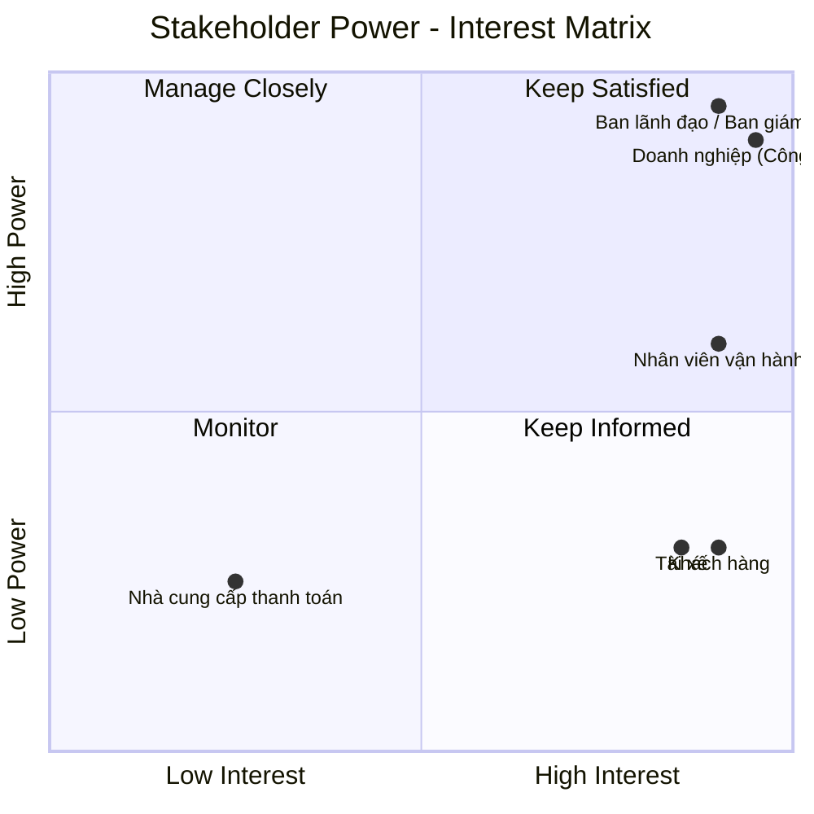

1. Đọc và phân tích yêu cầu sơ khởi của khách hàng ở giai đoạn 1
1.1 Business Context (Ngữ cảnh nghiệp vụ)
Công ty ABC là doanh nghiệp cung cấp dịch vụ đặt xe trực tuyến.
Hiện tại khách hàng có thể:
- Liên hệ tổng đài để yêu cầu xe.
- Hoặc sử dụng một ứng dụng đơn giản để yêu cầu xe.
- Doanh nghiệp muốn xây dựng hệ thống CAB System – Nền tảng đặt xe với thời gian xây dựng và triển khai là 7 tuần.
- Ban lãnh đạo mong muốn xây dựng một nền tảng CAB mới có khả năng:
- Phục vụ số lượng lớn khách hàng và tài xế.
- Có thể phát triển thêm các tính năng trong tương lai.
1.2 Business Problem (Vấn đề của nghiệp vụ)
Hệ thống hiện tại đang gặp các vấn đề sau:
- Việc phân công tài xế chủ yếu được thực hiện thủ công.
- Khách hàng khó theo dõi trạng thái chuyến đi.
- Thông tin thanh toán chưa được quản lý tập trung.
- Bộ phận vận hành gặp khó khăn khi muốn mở rộng hệ thống.

2. lập bảng xác định Stakeholders , lập ma trận Stakeholders matrix nêu ra tầm ảnh hưởng (bằng mermaid)
| Tên Stakeholder | Vai trò |
|---|---|
| Khách hàng | Đặt xe, theo dõi chuyến, thanh toán và đánh giá tài xế |
| Tài xế | Nhận chuyến, thực hiện chuyến và cập nhật trạng thái |
| Nhân viên vận hành | Quản lý, giám sát và hỗ trợ xử lý chuyến |
| Bộ phận kỹ thuật/IT | Quản lý, bảo trì và đảm bảo hệ thống hoạt động ổn định |
| Cổng thanh toán | Xử lý các giao dịch thanh toán điện tử |
| Dịch vụ thông báo | Gửi thông báo đến khách hàng và tài xế |

